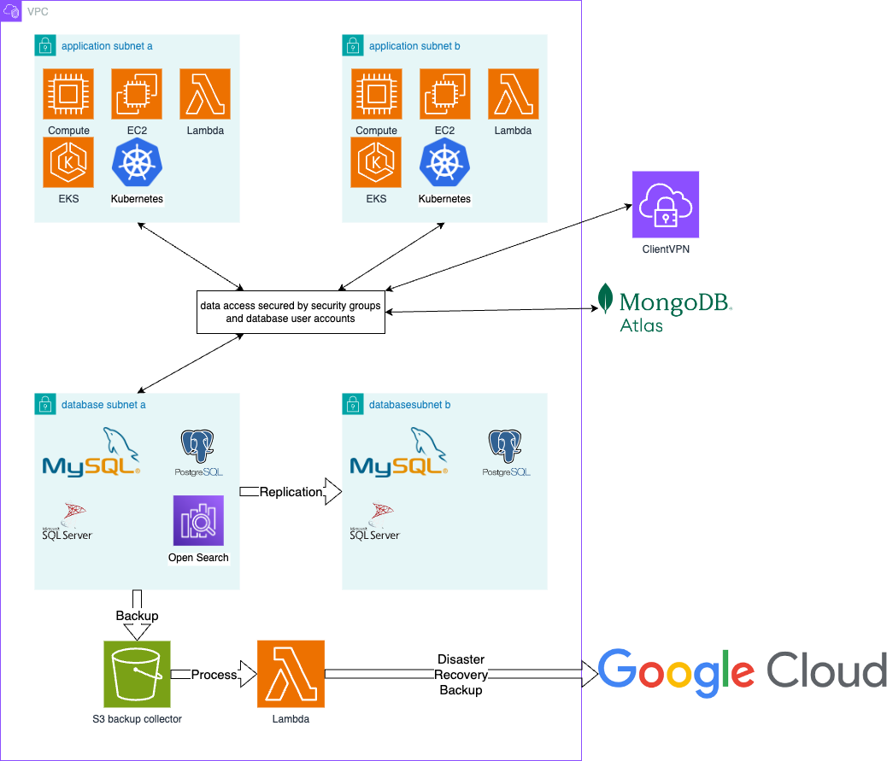
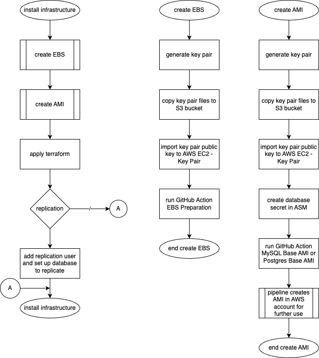

## Infrastructure Architecture
 \
The databases can be setup in three different ways which have various levels of complexity for setting up and maintenance of the systems. \
- OpenSearch is run as a service (installation is not done in this repository). \
- Microsoft SQL server is using RDS (installation is not done in this repository). \
- PostgresSQL and MySQL are installed on self-maintained EC2 instances.

The self-maintained setup is the most flexible and cost conscious approach but also the most involved one and requires a higher degree of database administration.
The database server uses an attached EBS holding all data which allows for instance replacement without transferring data between instances.
Instance replacement should be done a regular schedule updating the underlying OS and the database server. The database instances are not accessible
from outside AWS directly and sitting in private subnets. For maintenance purposes. it is possible to access the servers using the ClientVPC in London. \
The association between AMI, instance, parameters, security, DNS and EBS is done by project name. The primary and replica setup is handled by terraform.
```[database-type]-[project name]-[function]``` or ```[database-type]-[project name]```


## Prerequisites
Key pair for AMI creation and instance deployment \
Parameters in System Manager Parameter Sore (see setup sections for each DB type) \
Login Secrets in Sectres Manager (see setup sections for each DB type)

## Self-maintained EC2

### EBS
Installing an EBS for a database instance requires a particular key pair. This key pair is used to run a temporary instance responsible for initialising
the EBS ready to be attached to the DB instance.
The naming convention for this key is `ansible-build-[account]-[region]`, example _ansible-build-dev-eu-west-2_. \
Copy the private and public key to `s3://ds-[account]-kpf-administration/ansible` and import the public key to EC2 - Network & Security - KeyPair using
the naming of the key pair without any extension.
### AMI for Database Instances
#### Key Pair
Each DB instance has its' own key pair. The naming convention for the key is `[db-type]-[project-name]-[db-function]-[account]-[region]`,
example _mysql-main-replica-dev-eu-west-2_ \
Copy key pair files to S3 bucket `ds-[account]-kpf-administration` in the appropriate folder named after the DB type,
example _s3://ds-staging-kpf-administration/postgres_  and import the public key to EC2 - Network & Security - KeyPair using the naming of the key pair without any extension. \
#### Database Secrets
To create the DB instance several secrets need to be in place. In ASM (Amazon Secrets Manager) for each of the instances used a secret need to exist.
the naming of the secret is as follow, `/infrastructure/credentials/[db-type]-[project-name][function]`. The content for Postgres and MySQL are the
same but might change for other DB types.
```
{
  "root_password":"[strong-password]",
  "admin_user":"[remote-admin-user-name]",
  "admin_password":"[strong-password]",
  "repl_user":"[replication-user-name]",
  "repl_password":"[strong-password]",
  "network_cidr":"10.128.224.0/255.255.254.0"
}
```
The permission settings are:
- root user can only log in on local host;
- admin_user is enabled to connect remotely from the given network CIDR range (usually the ClientVPN); please use the correct notification for the DB type;
- repl_user and repl_password need to be in place even if no replication is set up;???
- network_cidr for access as remote administrator;

## Steps

1. Create an EBS for main instance and repeat for replica (optional).
2. Create an AMI and repeat for replica (optional).
3. Deploy main EC2 from AMI (2) and attach EBS (3).
4. Deploy replica EC2 from AMI (2) and attach EBS (3).
5. Setup replication (optional).
6. Create/restore databases.

### Apply Terraform
Terraform code assumes the existence of an EBS and an AMI accompanied by the key pair and, in case of the AMIs, the database secrets.
Generally, the primary database instances are placed in AZ 2a and optional replicas in AZ 2b. The security groups allow traffic of the applicable ports
from four private subnets and from ClientVPN.
It will not install any databases or database users apart from administrative accounts. The replication setup and process need to be initiated manually.
The internal endpoint URL can be set in terraform to expose the port to the private subnets. 
## Initialising AMI for MySQL and PostgreSQL.
Use GitHub Actions to create a general purpose AMI for MySQL or PostgreSQL.
The AMI only contains an image of an EC2 with basic setup for administrative users and network access defined in Secrets Manager and can be deployed
and configured to fit the needs.
For more details read sections underneath.

## Creating an general PostgreSQL AMI
Setup is minimal and only contains the postgres server, network settings and database administrator accounts with the appropriate permissions.
### postgres server
This is the standard installation of postgres15 using amazon-linux-extras. It is recommended that the available are monitored and update if and when required.
### network settings
The instance will be placed in a private db subnet. To define the subnets in postgres from which incoming traffic is allowed, the secret

## Setup Replication for PostgreSQL
The required steps to create a replication setup are done manually but uses two or more instances which can be installed with the base AMI. **Install
standby servers in different AZs.**  
This document describes the use of one standby server. Please refer to the PostgreSQL documentation when using more than one. The location of the conf
files as well as parameters can change when switching to other version. [PostgreSQL doumentation](https://www.postgresql.org/docs/)
### Primary Server
in */var/lib/pgsql/data/postgresql.conf*  
Following lines are not in order or might contain other values initially
```conf file
#wal_level = replica
#wal_log_hints = off
#max_replication_slots = 10
#max_wal_senders = 10
#archive_mode = on
#archive_command = ''
#cluster_name = ''
#synchronous_standby_names = ''
```
uncomment and change or add to
```conf file
wal_level = logical
wal_log_hints = on
max_replication_slots = 10
max_wal_senders = 10
archive_mode = on
archive_command = 'test ! -f /mnt/server/archivedir/%f && cp %p /mnt/server/archivedir/%f'
cluster_name = 'Metis'
synchronous_standby_names = 'ANY 1(Adrastea)'
```
in */var/lib/pgsql/data/pg_hba.conf* on the primary server add following line and replace the spaceholders with the correct values

```conf file
host all [replication_user] [CIDR_of_subnet] md5
```

### Standby Server
Create a base backup [Postgres documentation](https://www.postgresql.org/docs/14/app-pgbasebackup.html)
```pg_basebackup -h Metis -D /usr/local/pgsql/data```

in */var/lib/pgsql/data/postgresql.conf*
```
cluster_name = 'Adrastea'
primary_conninfo = 'host=[host_ip] port=5432 user=[replication_user] password=[password]'
```

### RDS
