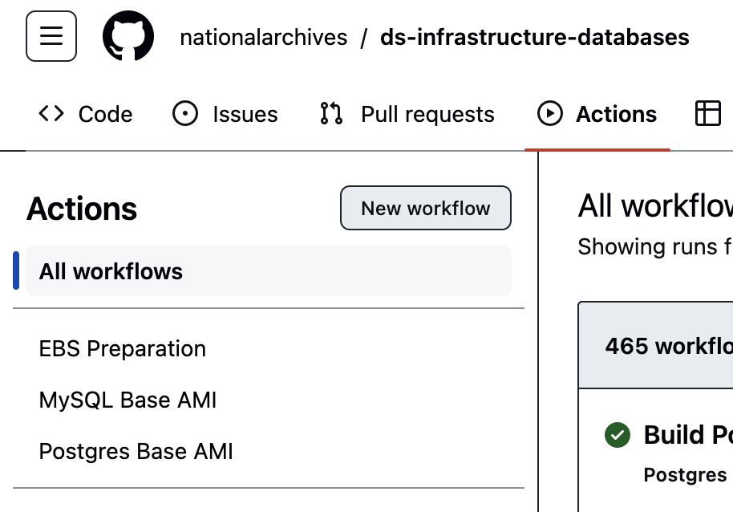
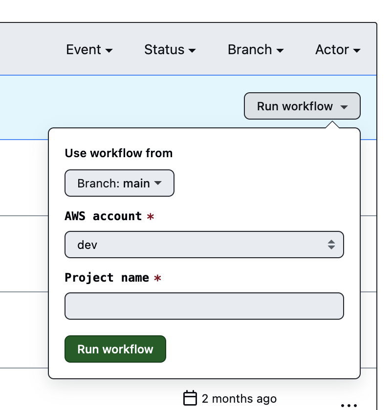

## Setting up MySQL instances
Setting up MySQL instance(s) relies on some assumptions and settings before  the initial build of a primer AMI can be done successfully.
1. The underlying infrastrcuture need to be in place including network information stored in SSM paramater store.
2. GitHub OIDC need to be set up to allow GitHub Actions to connect to the target account in AWS and to assume the role with the correct permissions.
3. Database administrative accounts need to be stored in ASM secrets.
4. The base instance has access to https://repo.mysql.com/ to download the latest version of MySQL Community Release.
5. Key Pair need to be created and added to EC2 - Key pairs

### AMI build
The base for a MySQL database instance is an initial AMI which can be prepared by using GitHub Actions. If the above requirments are in place the build process only need a project name. This allows to identify the AMI and the running instance(s).
To start the build process select in this repo the Actions tab and chose the menu item MySQL base AMI on the left. \
[](images/mysql-action-menu.png) \
When selected you can then start the workflow by clicking on ```Run workflow``` and input the account and project name. \
[](images/mysql-run-workflow.png) \
The newly create AMI can now be used to either replace an existing MySQL instance or be the starting point for a primary or replica server with the given project name. \
Before using the new AMI ensure that an EBS for this project already exists.
